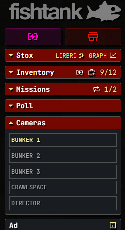
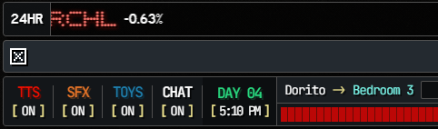

# fishtank-userscripts

UserScript to tweak/add features to [fishtank.live](https://www.fishtank.live/)

## Features (Season 4)

### Camera List Widget

Adds new camera widget to left panel above the ads widget.

Active camera highlight uses an observer to react when live stream name is changed. 
So, it should work on any camera transition (camera widget, arrow buttons, arrow keys, clickable stream areas)

### Chat Toggle Button

Adds chat toggle to the right of the TOYS status.

This toggles the right panel to `display: none` and allows theater mode without chat.

## Setup

Install [Tampermonkey](https://github.com/Tampermonkey/tampermonkey) or equivalent userscript manager as a browser extension

Either copy/paste `main.js` or use remote source `https://raw.githubusercontent.com/barrettotte/fishtank-userscript/refs/heads/master/main.js`
