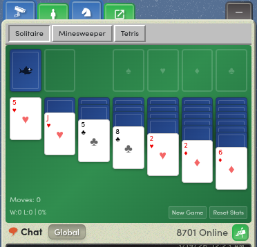
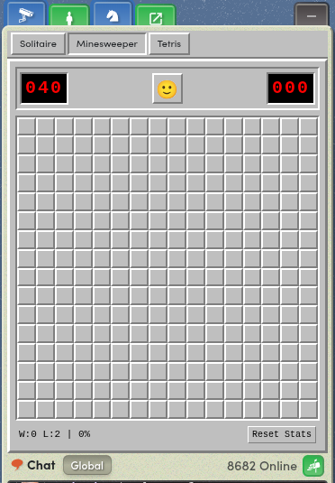

# fishtank-userscript

UserScript to tweak/add features to [fishtank.live](https://www.fishtank.live/)

Updated to support the new website for season 5.

Feel free to steal anything from this.
I'm hoping to continue updating this repo as seasons continue.

This was first started during season 2 in a different repo - https://github.com/barrettotte/fishtank-s02-qol.

## Setup

Install [Tampermonkey](https://github.com/Tampermonkey/tampermonkey) or equivalent userscript manager as a browser extension

Copy/paste `dist/main.js` (readable) or `dist/main.min.js` (minified) into Tampermonkey

## Season 5

### Camera List

Adds alternate cameras (Bar Alt, Dorm Alt, Market Alt) to the official camera widget.
Alternate cameras work by switching to the parent camera normally then auto-clicking the transition polygon.
Alternate cameras are automatically disabled when their parent camera is offline.

Removes audio clips played when hovering or switching cameras in the grid.

I originally had my own cam grid/list, but the site nicely implemented the grid officially.


### Games Tab

Adds games tab with Solitaire and Minesweeper for those downtimes where you have nothing else to do.
Win/loss stats are tracked in localStorage and persist across sessions.





### Misc

Adds tab to open the [Classic Fishtank site](https://classic.fishtank.live/)

## Classic

This userscript also supports [https://classic.fishtank.live/](https://classic.fishtank.live/) since I think it was never changed after season 4.

### Camera List Widget

Adds camera widget to left panel above the ads widget.

Active camera highlight uses an observer to react when live stream name is changed.
So, it should work on any camera transition (camera widget, arrow buttons, arrow keys, clickable stream areas)

On small screens (< 1100px) this widget will be hidden.


### Chat Toggle Button

Adds chat toggle to the right of the TOYS status.

This toggles the right panel to `display: none` and allows theater mode without chat.

On small screens (< 1100px) the chat toggle button will be hidden.


## Development

Source files are in `src/`, split by responsibility:

| File | Description |
|------|-------------|
| `classic.js` | Classic site (camera widget, chat toggle) |
| `common.js` | Shared constants and utilities |
| `entry.js` | Site detection and initialization |
| `minesweeper.js` | Minesweeper game |
| `new-site.js` | New site (alt cameras, tabs, observer) |
| `solitaire.js` | Solitaire game |

### Build

Uses [Vite](https://vite.dev/) with [vite-plugin-monkey](https://github.com/lisonge/vite-plugin-monkey) for bundling.

```bash
npm install
npm run build        # dist/main.js + dist/main.min.js
npm run build:test   # build with __TEST_MODE__=true (games start near-win)
npm run lint         # check for code issues
npm run lint:fix     # auto-fix code issues
```

Output files in `dist/`:

| File | Description |
|------|-------------|
| `main.js` | Readable, unminified build |
| `main.min.js` | Minified build |

Both include `@updateURL`/`@downloadURL` pointing to their respective files for auto-updates via Tampermonkey.
