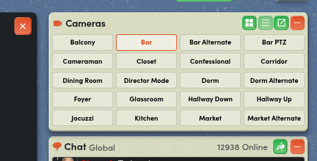
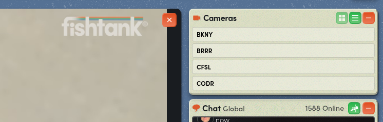
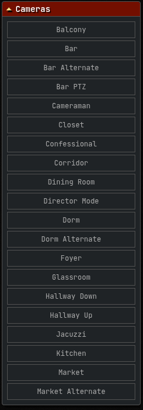
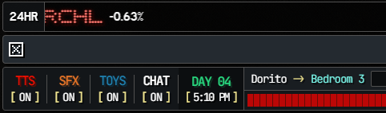

# fishtank-userscripts

UserScript to tweak/add features to [fishtank.live](https://www.fishtank.live/)

Updated to support the new website for season 5.

## Setup

Install [Tampermonkey](https://github.com/Tampermonkey/tampermonkey) or equivalent userscript manager as a browser extension

Either copy/paste `main.js` or use remote source `https://raw.githubusercontent.com/barrettotte/fishtank-userscript/master/main.js`

## Season 5

### Camera List Widget

Adds cameras widget to right panel above the chat widget.
Camera list can be displayed in grid of camera shortcodes matching the home screen or scrollable list.
The active camera is styled with the primary color in the camera list.

## Classic

This userscript also supports [https://classic.fishtank.live/](https://classic.fishtank.live/) since I think it was never changed after season 4.

### Camera List Widget

Adds camera widget to left panel above the ads widget.

Active camera highlight uses an observer to react when live stream name is changed. 
So, it should work on any camera transition (camera widget, arrow buttons, arrow keys, clickable stream areas)

On small screens (< 1100px) this widget will be hidden.

### Chat Toggle Button

Adds chat toggle to the right of the TOYS status.

This toggles the right panel to `display: none` and allows theater mode without chat.

On small screens (< 1100px) the chat toggle button will be hidden.

